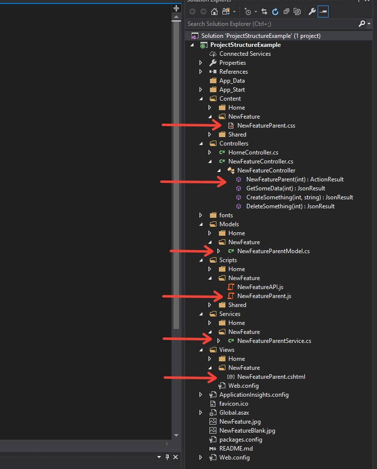

# .Net MVC UI structure

### Overview:
* This article presents a template for file and directory structure, naming conventions, and code patterns for helpful organization of a .Net MVC application UI. It may also serve as a guided walkthrough for addition  of a new feature or portion of an application.


### Project structure:
* Each feature or portion of the application should have a corresponding directory in ~/Views, ~/Scripts, ~/Content, ~/Services, and ~/Models, and a designated controller in ~/Controllers.

* The Views, Scripts, Content, Models, and Services folders are broken into subdirectories for different portions of the UI, and each subdirectory corresponds to a controller by the same name. Ie.
    * ~/Views/NewFeature
    * ~/Scripts/NewFeature
    * ~/Content/NewFeature
    * ~/Models/NewFeature
    * ~/Services/NewFeature
    * ~/Controllers/NewFeatureController.cs,

-There is a 1-1-1-1-1 of .cshtml, .js, .css, .cs(view model), .cs(service) files, housed in each of these subdirectories. For each view there is an ActionResult controller method returning a View().



### Controller:

* Our controller is broken up into 2 regions: Views, which will contain ActionResult methods that will render our view html, and Actions, which will contain the calls to trigger any CRUD operations, and return a JsonResult.

```C#
public ActionResult NewFeaturParent(int arg) {
    NewFeatureParentService service = new NewFeatureParentService();
    NewFeatureParentModel model = service.GetNewFeatureParentModel(arg);
    return View("~Views/NewFeature/NewFeaturParent", model);
}
```

* This is all a controller method should consist of. No logic, no various BR calls to collect data, only a single call to a service method(we will discuss this below) that gathers all the required data from various BR calls and packages them into a model specifically for that view.

* Say you need to retrieve some piece of data from your UI, but not necessarily html, or perform some action like a save or delete. Put a method in the Actions region of the controller that does a service method call to the service for this view and returns a JSON object.
```C#
public JsonResult GetSomeData(int arg)
{
    NewFeatureParentService service = new NewFeatureParentService();
    object json = service.GetSomeData(arg);
    return Json(json, JsonRequestBehavior.AllowGet);
}

public JsonResult CreateSomething(int param1, string param2)
{
    NewFeatureParentService service = new NewFeatureParentService();
    object json = service.CreateSomething(param1, param2); //Will return a response object
    return Json(response, JsonRequestBehavior.AllowGet);
}
```
### Models:

* Every view in the Views directory should have a corresponding model by the same name, suffixed with "Model".
* This model is to be used specifically for passing to it's corresponding view and nothing else. No models should be shared between views, even partials.

**===IMAGE===**

```C#
namespace ProjectStructureExample.Models.NewFeature
{
    public class NewFeatureParentModel
    {
        public int Id { get; set; }
        public string Description { get; set; }
        public string OtherProp { get; set; }
        public DateTime Date { get; set; }
    }
}
```
### Services:

* Every model in the Models directory should have a corresponding service by the same name, suffixed with "Service" instead of "Model".
* This service class contains at minimum a method that returns an object of the corresponding model type to the controller view method that calls it. This method would perform the various BR calls to gather any entity objects whos property values will be added to the view model.
* Any additional business logic or methods for filtering or manipluating data to attach to the view model will also be housed in this service class.
```C#
namespace ProjectStructureExample.Services.NewFeature
{
    public class NewFeatureParentService
    {
        public NewFeatureParentModel GetNewFeatureParentModel(int arg)
        {
            NewFeatureParentModel model = new NewFeatureParentModel();

            SomeEntity someEntity = new SomeEntity();
            MethodResult result = new MethodResult();
            using(SomeBR br = new SomeBR())
            {
                someEntity = br.GetSomeEntity(arg);
            }

            SomeOtherEntity someOtherEntity = new SomeOtherEntity();
            result = new MethodResult();
            using(AnotherBR br = new AnotherBR())
            {
                someOtherEntity = br.GetSomeOtherEntity(arg);
            }

            model.Id = someEntity.Id;
            model.Description = someEntity.Description;
            model.OtherProp = someOtherEntity.OtherProp;

            return model;
        }

        public object GetSomeData(int arg)
        {
            SomeEntity someEntity = new SomeEntity();
            MethodResult result = new MethodResult();
            using (SomeBR br = new SomeBR())
            {
                someEntity = br.GetSomeEntity(arg, result);
            }

            SomeOtherEntity someOtherEntity = new SomeOtherEntity();
            result = new MethodResult();
            using (AnotherBR br = new AnotherBR())
            {
                someOtherEntity = br.GetSomeOtherEntity(arg, result);
            }

            object obj = new
            {
                prop1 = someEntity.someData,
                prop2 = someOtherEntity.someOtherData
            };

            return obj;
        }

        public object CreateSomething(int param1, string param2)
        {
            MethodResult result = new MethodResult();
            using (SomeBR br = new SomeBR())
            {
                someEntity = br.Save(param1, param2, result);
            }

            object obj = new
            {
                result = result.Messages
            };
            return obj;
        }
    }
}
```

### Views:

* Each view should reference it's corresponding model at the top of the cshtml, followed by your markup, then an inline script tag at the bottom enclosed in a jquery $(document).ready() function, and containing a single line of javascript calling the Init() method for this views corresponding javascript object. The Init() method should be given a single parameter, a json encoded version of the view model.

```html
@model ProjectStructureExample.Models.NewFeature.NewFeatureParentModel

<button data-id="1" data-other="@Model.Description" onclick="ProjectStructureExample_NewFeatureContainer.CreateSomething(this)">Save</button>

<script>
    $(document).ready(function () {

        ProjectStructureExample_NewFeatureContainer.Init(JSON.parse('@Html.Raw(Json.Encode(Model))'));

    });
</script>
```

* There is one exception to this pattern in the html inline script tag. In the most parent view of a given feature or portion of the application, we will assign all controller method urls as properties to an API javascript object for this feature(discussed below). This allows global access of these urls from any of our javascript, without passing lots of messy parameters into our single Init() method in each individual view.

```html
@model ProjectStructureExample.Models.NewFeature.NewFeatureParentModel

<button data-id="1" data-other="other data" onclick="ProjectStructureExample_NewFeatureContainer.CreateSomething(this)">Save</button>

<script>
    $(document).ready(function () {

        ProjectStructureExample_NewFeature_API.NewFeatureParent = '@Url.Action("NewFeaturParent", "NewFeature")';
        ProjectStructureExample_NewFeature_API.GetSomeData = '@Url.Action("GetSomeData", "NewFeature")';
        ProjectStructureExample_NewFeature_API.CreateSomething = '@Url.Action("CreateSomething", "NewFeature")';
        ProjectStructureExample_NewFeature_API.DeleteSomething = '@Url.Action("DeleteSomething", "NewFeature")';

        ProjectStructureExample_NewFeatureContainer.Init(JSON.parse('@Html.Raw(Json.Encode(Model))'));

    });
</script>
```

### JavaScript:

* Each subdirectory in the Scripts folder contains a .js file suffixed with API. This file contains a javascript object that handles the client side routing for every controller method. So every time a method gets added to a controller, a corresponding method should be added to this API file.
* This javascript method should take 2 parameters, and contain the ajax call to it's corresponding controller method. The first paremeter is an object that will be passed as the data object for the ajax call. The second is a callback function to be executed on the completion of the ajax call.

```javascript
const ProjectStructureExample_NewFeatureAPI = {

    NewFeatureParent: function (params, callback) {

        $.get(this.urls.NewFeatureParent, params, function (res) {

            if (callback) callback(res);

        });

    },

    CreateSomething: function (params, callback) {

        $.post(this.urls.CreateSomething, params, function (res) {

            if (callback) callback(res);

        });

    },

    DeleteSomething: function (params, callback) {

        $.post(this.urls.DeleteSomething, params, function (res) {

            if (callback) callback(res);

        });

    }

};
```

* For every view in the Views directory, there should be a corresponding javascript file in the appropriate subdirectory of the Scripts folder.
* This file will contain a single javascript object with the naming convention ProjectName_ViewName.
* Every one of these view corresponded js objects should at minimum contain a single Init() method, containing any initialization actions required for the view.

```javascript
const ProjectStructureExample_NewFeatureParent = {
    Init: function (model) {

        console.log('View initialzed');

    }
}
```

* Calls to these object methods may also be may directly from onclick events in the views html elements.
```html
<button data-id="1" onclick(ProjectStructureExample_NewFeatureParent.CreateSomething(this)) class="my-button ProjectStructureExample_standard-button">Save</button>
```

  ```javascript
const ProjectStructureExample_NewFeatureParent = {

    CreateSomething: function (element) {

        const data = {
            param1: $(element).data('something'),
            param2: $(element).data('other')
        };

        ProjectStructureExample_NewFeature_API.CreateSomething(data, function (res) {

            console.log(res);

        });

    },

    DeleteSomething: function () {

        const data = {
            param1: $(element).data('id')
        };

        ProjectStructureExample_NewFeature_API.DeleteSomething(data, function () {

            console.log(res);

        });

    }

}
```

* The Scripts folder contains a "Shared" folder containing subdirectories for any jQuery plugins, an "External" folder for jquery, bootstrap, etc. source code, and a Shared.js file containing javascript helper functions that may be reused throughout the application.
* This Shared.js file will follow the same pattern as the individual view javascript, an object with the naming convention ProjectName_Shared.
* Any methods added to this shared object should be approved by a team lead and appropriately documented before check in.
```javascript
/*======================================================================================================================
   Anything added to this file must approved and documented. Include above your method a comment section
   with a thorough description of what this method does and how to apply it.
======================================================================================================================*/

const ProjectStructureExample_Shared = {

    /*This method receives a jQuery object as a parameter. It applies various events to this
     element to only allow the user to input numbers, limit the number of characters,
     and automatically insert "/" characters between mm/dd/yyyy.*/
    KeystrokeDateValidation: function (element) {

        function checkValue(str, max) {

            if (str.charAt(0) !== '0' || str == '00') {

                const num = parseInt(str);

                if (isNaN(num) || num <= 0 || num > max) num = 1;

                str = num > parseInt(max.toString().charAt(0)) && num.toString().length == 1 ? '0' + num : num.toString();

            };

            return str;
        };

        element.on('keyup', function (e) {

            const input = $(this).val();
        ...
```

### CSS:
* For every view in the Views directory, there should be a corresponding javascript file in the appropriate subdirectory of the Scripts folder.
* This file will contain any view specific styles.
```CSS
.my-button{
    background-color: lavenderblush;
}
```

* The Content folder contains a "Shared" folder containing subdirectories for any jQuery plugins, an External folder for jquery, bootstrap, etc. code, and a Shared.css file containing any styles used site-wide.
* Any styles added to this style sheet should be approved by a team lead and appropriately documented before check in.

```CSS
/*===========================================================================================================================
1) Anything added to this style sheet must approved and documented. Include above your style a comment section
   with a thorough description of what this style does and how to apply it.
2) Styles here should be very spefic and widely applicable i.e. widely used button styles, modal headers, etc. If the
   class is meant to be used in tandem with a shared js, put that in a separate directory i.e. ycDropdown/ycDropdown.css
3) All styles in this stylesheet sould be prefixed with ProjectName_ i.e. .ProjectName_standard-button.
===========================================================================================================================*/

/*Applies standard size, color, shape, and cursor style to button. Must
    be used on a <button> element.*/
button.ProjectStructureExample_standard-button {
    background-color: lightgray;
    cursor: pointer;
    border-radius: 10px;
    color: gray;
    height: 30px;
    width: 70px;
}
```
